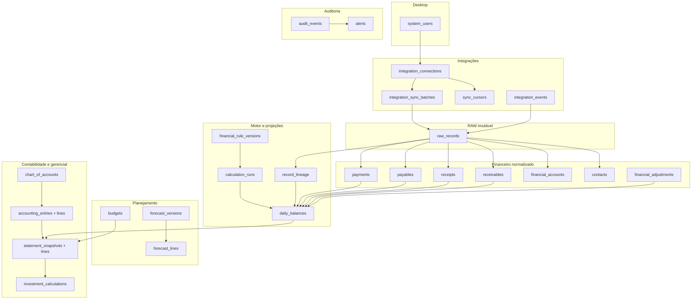
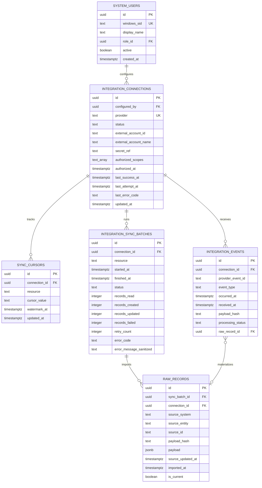
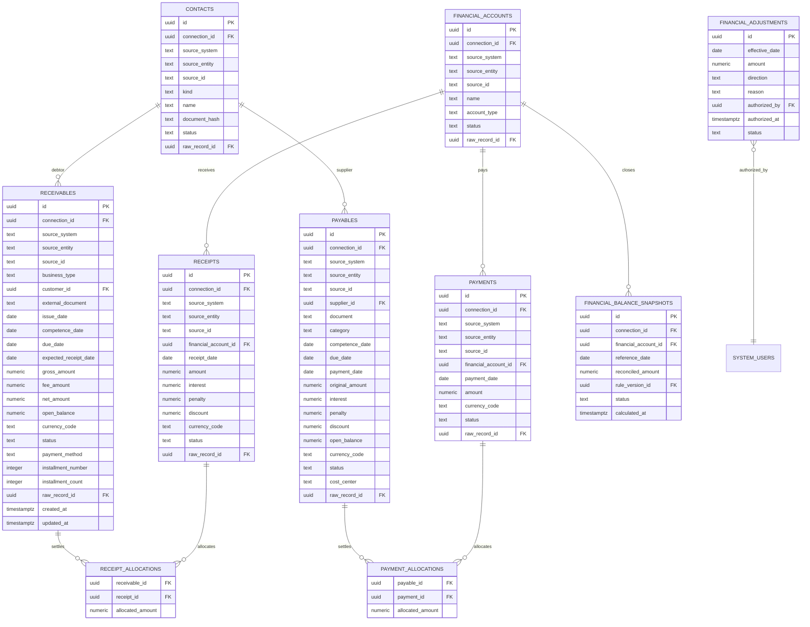
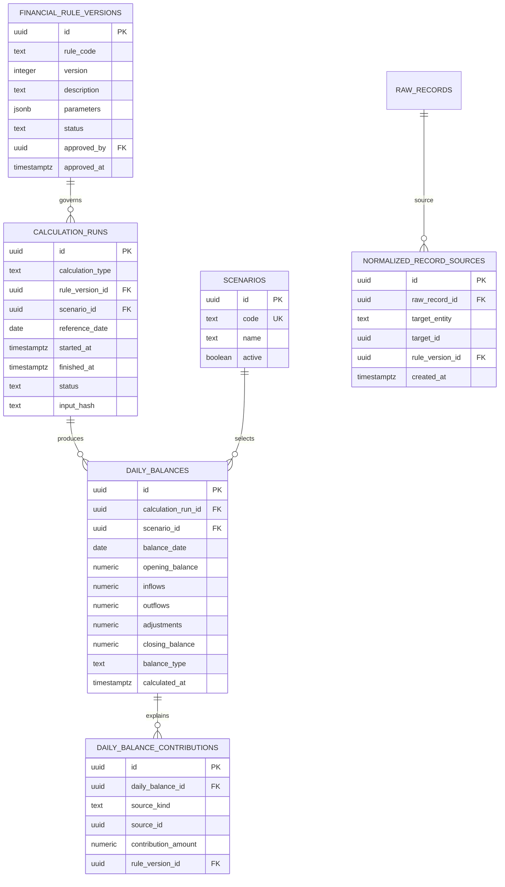
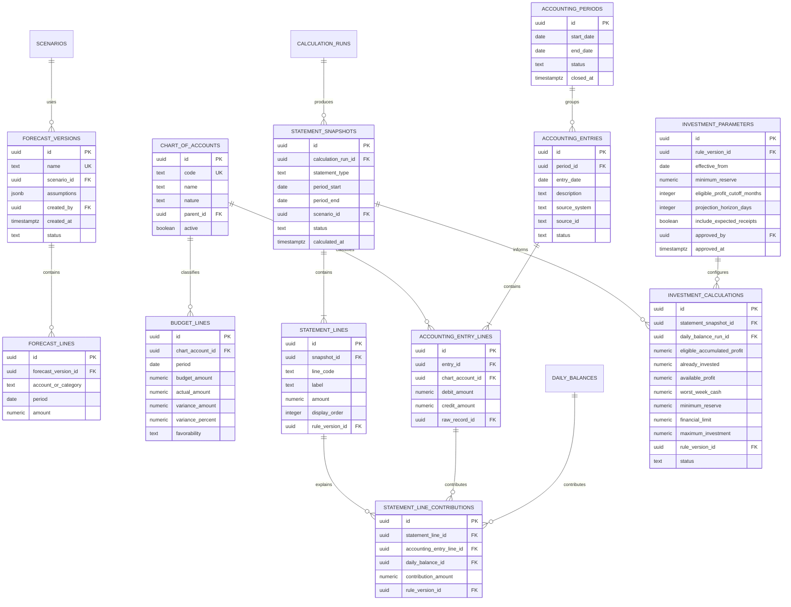

# ERD v1 - Majucau Financial Intelligence

- **Status:** Proposto para aprovação
- **Banco:** PostgreSQL local dedicado
- **Objetivo:** modelar integração, RAW, normalização, finanças, planejamento, contabilidade, auditoria e credenciais sem perder rastreabilidade.

## 1. Princípios do modelo

1. RAW é append-only para sincronização e regras: uma nova versão do payload cria novo registro; não há sobrescrita silenciosa. A única mutação permitida é redação LGPD autorizada, que substitui PII por tombstone auditável e preserva o hash anterior.
2. Todo registro tratado aponta para um ou mais registros RAW por tabelas de contribuição tipadas, com FKs reais, e para a versão da regra aplicada.
3. `source_system + source_entity + source_id + payload_hash` evita repetição do mesmo estado externo.
4. Realizado, provisório e projetado não compartilham significado implícito.
5. Competência, vencimento, previsão e liquidação possuem datas distintas.
6. Valores monetários são decimais exatos.
7. Snapshots e forecasts são versionados; histórico não é sobrescrito.
8. Credenciais não são armazenadas no banco em texto aberto. O banco mantém somente metadados e um `secret_ref` opaco para o cofre DPAPI.

## 2. Visão por camadas



## 3. ERD do núcleo de integração



Constraints essenciais:

```sql
unique (connection_id, resource) on sync_cursors
unique (connection_id, provider_event_id) on integration_events
unique (connection_id, source_system, source_entity, source_id, payload_hash) on raw_records
```

Um índice parcial garantirá no máximo uma versão `is_current = true` por `connection_id/source_system/source_entity/source_id`.

`integration_sync_logs` será uma view sobre `integration_sync_batches`, preservando o contrato nominal do handoff sem duplicar os dados de execução.

RBAC será efetivo no worker, não somente declarativo. `roles`, `permissions` e `role_permissions` formarão catálogo versionado; toda chamada IPC carrega o SID autenticado do cliente, que deve corresponder a `system_users.windows_sid`. O usuário único inicial recebe `ADMIN`, mas operações materiais (`CREDENTIAL_WRITE`, `INTEGRATION_DISCONNECT`, `MANUAL_ADJUST`, `PERIOD_CLOSE`, `BACKUP_EXPORT`, `RESTORE`, `UPDATE`) passam pela mesma autorização e geram auditoria. Testes negativos usarão SID não cadastrado e permissão ausente.

## 4. ERD financeiro



Constraints essenciais:

```sql
unique (connection_id, source_system, source_entity, source_id) on contacts
unique (connection_id, source_system, source_entity, source_id) on financial_accounts
unique (connection_id, source_system, source_entity, source_id) on receivables
unique (connection_id, source_system, source_entity, source_id) on receipts
unique (connection_id, source_system, source_entity, source_id) on payables
unique (connection_id, source_system, source_entity, source_id) on payments
primary key (receivable_id, receipt_id) on receipt_allocations
primary key (payable_id, payment_id) on payment_allocations
unique (connection_id, financial_account_id, reference_date, rule_version_id) on financial_balance_snapshots
check (business_type in ('B2B', 'B2C', 'B2C_EXCLUDED_FROM_BLING_FUTURE', 'UNCLASSIFIED'))
check (installment_number >= 1)
check (installment_count >= installment_number)
```

## 5. Projeções, regras e linhagem



Constraints:

```sql
unique (rule_code, version) on financial_rule_versions
unique (calculation_run_id, balance_date) on daily_balances
check (balance_type in ('REALIZED', 'PROVISIONAL', 'PROJECTED'))
check (scenario.code in ('BASE', 'CONSERVATIVE', 'STRESS', 'OPTIMISTIC'))
```

Não criar `unique(date, scenario, balance_type)` global, pois isso apagaria a possibilidade de histórico. A unicidade pertence ao `calculation_run_id`.

O diagrama acima resume as famílias de linhagem. A migration não poderá implementar `target_entity/target_id` ou `source_kind/source_id` como FKs polimórficas sem integridade. Serão criadas tabelas tipadas:

- `contact_sources`, `financial_account_sources`, `receivable_sources`, `receipt_sources`, `payable_sources` e `payment_sources`, cada uma com FK para a entidade normalizada, FK para `raw_records`, FK para `financial_rule_versions` e PK composta;
- `financial_balance_snapshot_sources`, com FKs para o snapshot de saldo, os RAW de conta/lançamento e a regra de composição;
- `daily_balance_receivable_contributions`, `daily_balance_receipt_contributions`, `daily_balance_payable_contributions`, `daily_balance_payment_contributions` e `daily_balance_adjustment_contributions`, cada uma com FKs reais para `daily_balances` e para a entidade contribuinte;
- `statement_line_contributions`, com FK para `statement_lines` e exatamente uma FK de origem entre `accounting_entry_lines` e `daily_balances`, validada por `check`.

`record_lineage` poderá existir somente como view `UNION ALL` de leitura. Não será a fonte de integridade. Testes deverão percorrer card -> snapshot/linha -> contribuição tipada -> entidade -> RAW, falhando se qualquer caminho estiver ausente.

Nos contratos de leitura, `receivables.source_payload_reference` e `payables.source_reference` serão arrays de UUID derivados de `receivable_sources` e `payable_sources`. Não serão colunas textuais nem substituirão as FKs tipadas.

## 6. Planejamento e demonstrações



Constraint obrigatória de `statement_line_contributions`: exatamente uma das colunas `accounting_entry_line_id` e `daily_balance_id` deve estar preenchida. A migration deve usar FKs, `check` XOR e teste de deleção/restrição.

`dre_snapshots`, `pnl_snapshots`, `ebitda_snapshots` e `working_capital_snapshots` serão views tipadas sobre `statement_snapshots`, filtradas por `statement_type`. `working_capital_snapshots` expõe também `current_assets`, `current_liabilities` e a diferença, todos com lineage. As views mantêm os nomes literais do handoff; a tabela física comum mantém versionamento e auditoria uniformes.

## 7. Auditoria e alertas

| Entidade | Finalidade | Campos mínimos |
|---|---|---|
| `audit_events` | Ações materiais e alterações de configuração | ator, ação, entidade, ID, before/after sanitizado, timestamp, correlation ID |
| `alerts` | Riscos financeiros ou operacionais | tipo, severidade, status, mensagem simples, referência, aberto/resolvido em |
| `accounting_adjustments` | Diferenças DRE/P&L e ajustes contábeis | descrição, motivo, valor, usuário, data, aprovação |
| `data_quality_issues` | Divergências, ausência, atraso e inconsistência | regra, entidade, registro, severidade, status e resolução |

Segredos, tokens e payloads pessoais completos não entram em `audit_events`.

Tipos iniciais de `alerts`: `CASH_BELOW_MINIMUM_RESERVE`, `OVERDUE_PAYABLES`, `OVERDUE_RECEIVABLES`, `LARGE_PAYMENT_DUE`, `EBITDA_RELEVANT_DROP`, `SYNC_ERROR`, `ACCOUNTING_DIVERGENCE` e `STALE_DATA`.

## 8. Decisões ainda sujeitas à aprovação funcional

1. Moeda BRL como única moeda do MVP.
2. Timezone `America/Sao_Paulo`.
3. Precisão/escala e política de arredondamento.
4. Regras para classificar um contato/recebível Bling como B2B.
5. Status de cancelamentos, estornos, chargebacks e reembolsos.
6. Campos exatos de `receipts`, `payments` e contas financeiras conforme payload real.
7. Plano de contas e regras de classificação DRE/P&L.
8. Fórmula completa da aplicação conforme modelo de referência ainda inexistente.
9. Forma oficial de obter taxas, líquido e agenda do Nuvem Pago.
10. Política LGPD para retenção, pseudonimização e redação auditável de PII em RAW e backups.

Essas decisões bloqueiam os cálculos e módulos dependentes. A fundação técnica pode ser construída isoladamente, mas nenhum resultado afetado poderá receber status `CONFIRMED` nem passar pelos gates G2/G3/G5/G7 antes dos respectivos oráculos e regras serem aprovados.

## 9. Validações estruturais obrigatórias

- débitos = créditos por lançamento contábil;
- Ativo = Passivo + Patrimônio Líquido;
- Saldo Final D = Saldo Inicial D + Entradas - Saídas ± Ajustes;
- Saldo Inicial D+1 = Saldo Final D;
- Total futuro = B2C Nuvem + B2B Bling, sem B2C Bling;
- nenhuma alocação supera saldo do título ou valor da liquidação;
- toda transformação material possui lineage;
- toda sincronização é idempotente;
- snapshots e forecasts nunca são sobrescritos.
