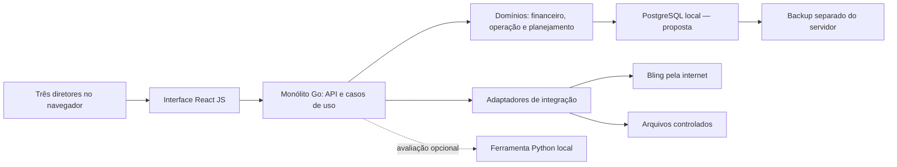

# Majucau — análise das referências e decisões, versão 0

O material foi lido para planejar o desenvolvimento. Nenhum arquivo original foi alterado e nenhuma funcionalidade, issue, commit ou instalação do produto foi criada. O GitHub foi consultado em modo de leitura.

## Decisões recebidas nesta conversa

- **D-01 — Empresa atendida:** Somente Majucau. A resposta anterior sobre várias empresas foi corrigida pelo usuário.
- **D-02 — Usuários:** Três pessoas da diretoria, cada uma em seu computador.
- **D-03 — Hospedagem:** Local, em computador/servidor Windows existente. Demais características ainda desconhecidas.
- **D-04 — Primeira produção:** Todos os módulos confirmados do material na primeira entrada em produção; etapas internas são permitidas para organizar o trabalho.
- **D-05 — Conflitos entre fontes:** Analisar caso a caso com o usuário. Não existe precedência global da planilha sobre imagens.
- **D-06 — Tecnologias:** Monólito com DDD e arquitetura hexagonal; backend Go; frontend JavaScript com React.
- **D-07 — Balanço Patrimonial:** Fora da primeira versão; retirar o item dos menus por decisão explícita do usuário.
- **D-08 — Natureza desta entrega:** Somente análise e backlog. Não desenvolver o produto nesta etapa.
- **C-01 — Pagamento diferente do título:** Marcar divergência e manter o título sem baixa até a análise. Casos complementares serão detalhados em BK-005.
- **C-02 — Semana crítica:** A semana com o maior total de despesas. A posição de caixa dentro dela ainda precisa ser definida.
- **C-03 — Lucro elegível:** A DRE calculada pelo Majucau. Período elegível e composição do valor já investido ainda precisam ser detalhados.

Os três conflitos C-01, C-02 e C-03 foram respondidos. Isso não resolve automaticamente a posição de caixa dentro da semana, o corte temporal do lucro ou a composição do já investido. Planilha e imagens continuam sendo referências analisadas caso a caso. Frases como "aprovado" e "bloqueado" nos documentos descrevem seu estado documental; não comprovam desenvolvimento, teste ou uma nova autorização nesta conversa.

## Material e cobertura

Foram examinados 16 arquivos PNG, correspondentes a 15 imagens únicas, e as 20 abas da planilha. A extração encontrou 845 linhas não vazias, incluindo títulos e cabeçalhos. A matriz contém 58 regras; o catálogo I_Testes contém 167 cenários previstos. O arquivo de imagem com nome ChatGPT é idêntico ao T10, confirmado por SHA-256.

| Tela | Módulo | Cobertura | Tarefa da interface |
|---|---|---|---|
| T01 | Visão Executiva | Sem imagem | BK-102 |
| T02 | Fluxo de Caixa | Imagem recebida | BK-062 |
| T03 | Contas a Receber | Imagem recebida | BK-057 |
| T04 | Contas a Pagar | Imagem recebida | BK-059 |
| T05 | Conciliação | Imagem recebida | BK-055 |
| T06 | DRE | Imagem recebida | BK-067 |
| T07 | Balancete | Imagem recebida | BK-069 |
| T08 | Calculadora de Aplicação | Imagem recebida | BK-073 |
| T09 | Estoque | Imagem recebida | BK-078 |
| T10 | Produção | 2 arquivos idênticos | BK-081 |
| T11 | Compras | Contrato disponível; imagem ausente | BK-086 |
| T12 | Projeções | Imagem e contrato | BK-096 |
| T13 | Lançamentos e Pendências | Imagem e contrato | BK-099 |
| T14 | Alertas | Imagem e contrato | BK-101 |
| T15 | Importações e Integrações | Imagem e contrato | BK-052 |
| T16 | Parâmetros | Imagem e contrato | BK-037 |
| T17 | Usuários | Imagem e contrato | BK-035 |
| Sem número confirmado | Aplicações | Sem imagem própria | BK-074 |
| Bloco a localizar | Pricing / preço e margem | Matriz; UI pendente | BK-075 |
| Bloco a localizar | Logística | Matriz; UI pendente | BK-076 |
| Escopo a detalhar | Produtos, Simuladores e Relatórios | Citações em menus | BK-103 |

**Documentos apenas citados:** Markdown.md, RC-3 Financeiro DEV_LOCK, RC-3 BUSINESS_RULE_LOCK_WIREFRAMES e RC-2.2 Comercial/Logística. Eles não vieram no pacote. Seus conteúdos completos não foram lidos; as afirmações sobre eles provêm da consolidação fornecida. Também faltam o visual de T01, o visual de T11 e a especificação completa dos módulos/blocos adicionais da tabela.

**GitHub:** o [repositório Majucau](https://github.com/guilhermejacyzin/majucau) está vazio. A [consulta de arquivos](https://api.github.com/repos/guilhermejacyzin/majucau/contents) retornou explicitamente "This repository is empty". O nome padrão configurado é main, ainda sem commit materializado. Não há implementação versionada para auditar. Isso não prova inexistência de trabalho fora desse repositório.

## Arquitetura proposta para o cenário informado

Um dos computadores Windows, ou uma máquina dedicada, hospeda a aplicação. Os três diretores acessam pelo navegador em um endereço da rede. O servidor concentra dados, login, regras e sincronizações. Ainda é preciso confirmar qual computador será o servidor e se haverá acesso fora da empresa.

Arquitetura hexagonal significa manter as regras de negócio separadas de banco, HTTP e formatos de arquivo. DDD organiza o sistema pela linguagem do negócio. Monólito significa uma aplicação principal dividida internamente em módulos, com uma instalação coordenada. A tela não contém a regra financeira oficial: ela consulta o Go.

**Banco proposto:** PostgreSQL local, sujeito à avaliação do Windows e da operação. Valores monetários e quantidades precisam de representação exata e arredondamento aprovado. PostgreSQL documenta `numeric` como tipo exato; no Go e no contrato com JavaScript também será necessário evitar conversões aproximadas para dinheiro. [Tipos numéricos do PostgreSQL](https://www.postgresql.org/docs/current/datatype-numeric.html).

**Integrações:** Bling por adaptador de leitura, tokens no servidor, acesso mínimo, paginação e retomada. O fluxo OAuth exige validar o endereço de retorno para a instalação local. A documentação de limites orienta fracionar consultas históricas; limites serão reconfirmados ao implementar. Nuvem por arquivo é requisito candidato da consolidação, sem criar API adicional por suposição. [Aplicativos Bling](https://developer.bling.com.br/aplicativos), [limites Bling](https://developer.bling.com.br/limites).

**Python:** avaliar para séries temporais e preparação de planilhas após medir necessidade. pandas ou Polars devem ser escolhidos pelos formatos, memória e tempo em amostras reais. NumPy pode apoiar operações numéricas quando o algoritmo precisar. Uma ferramenta Python local controlada pelo Go preserva contratos e versões; não deve criar uma segunda regra financeira ou gravar diretamente nas tabelas dos outros domínios. Streamlit pode servir a experimentos internos, mas a interface oficial continua React. Nenhuma dessas ferramentas adicionais foi escolhida como requisito obrigatório.

**Operação local:** Windows, PostgreSQL e aplicação precisam iniciar corretamente após reinício, sobreviver a falhas de integração e permitir restauração. Hospedagem local não elimina internet para atualizar Bling e sinais externos. Backup inclui banco e arquivos, em destino separado, com ensaio de recuperação. [Backup PostgreSQL](https://www.postgresql.org/docs/current/backup.html).

**Entrega:** como o GitHub é público, a proposta é validar e empacotar sem executar código de contribuições não confiáveis na máquina de produção ou na rede local. A instalação da versão será controlada. O GitHub documenta riscos de executores próprios que alcançam segredos e serviços de rede. [Segurança dos executores GitHub Actions](https://docs.github.com/en/actions/reference/security/secure-use#hardening-for-self-hosted-runners).

## Leitura detalhada de T02 a T08

As observações abaixo descrevem o material recebido. Quando citarem conflito C-01/C-02/C-03 ou Balanço Patrimonial, considerar a decisão atual registrada no início deste documento. Os valores dos exemplos não foram tratados como dados reais da Majucau.

### T02 — Fluxo de Caixa

**O que aparece:** posição 16/08/2026 14:32; sincronização 14:31; saldo atual R$258.420 com indicação de banco conciliado e atualização própria 14:25; entradas 30 dias R$542.680; saídas 30 dias R$589.230; menores saldos 30/60 dias R$112.540/R$91.870, datas e folgas; gráfico de entradas, saídas, realizado e projetado; semana crítica 14/09–20/09, saídas R$186.400, entradas R$121.300 e reserva R$50.000; posição da semana pendente de decisão; recebido no mês R$301.240, pago R$278.960, reserva R$50.000, saldo transferível R$96.800 e nível de caixa OK. Alertas: abaixo do mínimo, saídas sem categoria, atrasos e conciliação pendente.

**Ações visíveis:** atualizar, exportar (menu sem formatos definidos), ajuda, expandir indicadores, ver fluxo completo, detalhes da semana, abrir lançamentos/recebíveis/conciliação a partir dos alertas. Não há filtro de período explícito equivalente ao que aparece em outras telas.

**Dados e dependências:** contas e saldos bancários, movimentos realizados, títulos a pagar/receber, recebimentos previstos, critérios de deduplicação entre Bling e fontes externas, calendário e cortes de data, reserva versionada, origem e qualidade de cada parcela. Conciliação, importações, parâmetros e regra da semana crítica precedem o cálculo confiável.

**Trabalho de backlog:** especificar dicionário de KPIs e séries; separar saldo, fluxo líquido e movimentos; implementar posteriormente consultas por posição/período com mesma base entre cartões, gráfico e detalhe; estabelecer navegação contextual; criar cenários de saldo negativo, dado ausente, fonte antiga e valores previstos substituídos por realizados.

**Aceite sugerido:** saldo projetado reproduz a equação aprovada usando exatamente os movimentos selecionados; cada entrada aparece uma vez; mudar período atualiza todas as regiões; um clique no KPI abre o conjunto de registros que explica seu valor; fontes indisponíveis não viram zero; semana crítica respeita critério, janela, desempate e posição de caixa aprovados.

### T03 — Contas a Receber

**O que aparece:** total R$367.890, 82 clientes/28 boletos; recebido no mês R$214.560; atraso R$58.240/5 recebimentos; conciliação 91,3%. Tabela de cliente, origem Bling, vencimento, valor bruto, líquido e status. Distribuição: CONFIRMED R$223.480, PENDING_RECONCILIATION R$74.360, PROVISIONAL R$41.700, DIVERGENT R$28.350. Cartões de Pix R$86.200, boletos R$74.800 e cartão R$149.560; 3 ambíguos, 2 chargebacks. Alertas sobre atraso, ambiguidade, 7 transações sem ID Bling e regras de correspondência.

**Ações visíveis:** atualizar, exportar, ajuda, detalhes/recebimentos/atrasos/conciliação, lista completa, distribuição por status e regras.

**Dados e dependências:** título, pedido, transação, evento de liquidação, cliente, parcelas, moeda, datas previstas/efetivas, valores brutos/líquidos/taxas, estornos/chargebacks, identificadores externos e conciliação. O catálogo I_Testes exige preservar valores exportados de taxas e líquido; tabela contratual não pode cobrar novamente evento já líquido.

**Trabalho de backlog:** definir universo do total e do recebimento; distinguir venda, direito a receber, previsão e dinheiro liquidado; modelar eventos de estorno/contestação sem apagar a origem; separar situação do título, correspondência e qualidade da fonte; permitir análise por vencimento e trilha de origem.

**Aceite sugerido:** pedido Bling e evento Nuvem não somam duas vendas; previsão substituída por liquidação não duplica caixa; evento especial preserva sinal e tipo; título futuro pode estar conciliado documentalmente sem ser apresentado como recebido; totais por status e meio de pagamento reconciliam com o universo explicitado.

### T04 — Contas a Pagar

**O que aparece:** total R$412.670; vence hoje R$38.420/12 contas; atraso R$67.950/9 obrigações; divergências R$14.880. Tabela de fornecedor, documento, vencimento, valor, categoria e status. Distribuição CONFIRMED R$249.820, PROVISIONAL R$80.200, OVERDUE R$67.950, DIVERGENT R$14.700. Cartões de fornecedores ativos, fretes, impostos por competência, regra sem pagamento parcial, próximos sete dias; alertas por vencimento, atraso, diferença de valor e proibição de parciais.

**Ações visíveis:** atualizar, exportar, ajuda, detalhes, contas que vencem hoje, atrasos, conciliação, lista completa, distribuição e regra.

**Dados e dependências:** obrigação constituída, fornecedor/documento/parcela, vencimento, movimento e evidência de quitação, classificação, eventual despesa de frete/tributo. A_Matriz_Mestra M-006 exclui compras apenas sugeridas/forecast da constituição automática de A Pagar.

**Trabalho de backlog:** resolver C-01 antes de implementar baixa/saldo; descrever máquina de estados de obrigação e conciliação; calcular aging e vencimentos sem misturar qualidade do dado com atraso; ligar divergência à evidência original sem alterar valores para fechar.

**Aceite sugerido:** cenário título R$1.000/movimento R$600 tem um único resultado aprovado; testar também R$999,99, dois movimentos de R$500 e pagamento integral após vencimento; mesma obrigação não é repetida por importação; sugestão de compra não cria conta a pagar; vencido usa corte de data aprovado.

### T05 — Conciliação

**O que aparece:** 1.284 conciliados, 54 pendentes, 3 ambíguos, 17 divergentes; total 1.358. Tabela liga venda Bling, transação Nuvem, cliente, valor bruto, data de recebimento e status MATCHED/PENDING/AMBIGUOUS/DIVERGENT. Prioridade ID Bling, fallback nome+valor; reuso bloqueado; chargebacks vinculados à origem; 7 transações sem ID para análise manual.

**Ações visíveis:** atualização, exportação, ajuda, detalhes por situação, conciliação completa, regras, transações e divergências. A imagem não define a operação de confirmar, desfazer ou resolver manualmente um vínculo.

**Dados e dependências:** chaves compostas de transação e evento, identificação de título/pedido/movimento, regras de normalização e unicidade, motivos, candidatos, regras versionadas, ator/data/evidência da decisão. A_Matriz_Mestra menciona também Itaú e Mercado Pago conforme o caso, enquanto a tela destaca apenas Bling × Nuvem: a cobertura precisa ser confirmada.

**Trabalho de backlog:** contrato de matching determinístico conservador; sem escolher candidato aproximado; seleção de candidatos e explicação do resultado; exclusividade de uso do movimento com controle concorrente; revisão manual e eventual desfazimento com permissão e histórico; reprocessamento idempotente.

**Aceite sugerido:** um único par com evidência suficiente pode conciliar; dois candidatos permanecem pendentes/ambíguos; atraso isolado não invalida pagamento; eventos legítimos distintos do mesmo pedido não são deduplicados por order_id; concorrência não permite consumir o mesmo movimento duas vezes; alteração manual mantém antes/depois, motivo, ator e fonte.

### T06 — DRE

**O que aparece:** receita bruta R$512.800; líquida R$468.920; lucro bruto R$196.840 e margem 41,8%; resultado líquido R$74.380. Tabela de receita bruta, deduções, líquida, CMV/CPV, lucro bruto, despesas operacionais, perdas, resultado operacional, resultado financeiro, tributos e resultado líquido. Gráfico de composição; cartões de custos/despesas/perdas/tributos e 12 UNMAPPED. Alertas: classificação ausente, competência de perdas pendente, resultado financeiro em revisão e ausência de conta automática de fechamento.

**Ações visíveis:** atualizar, exportar, ajuda, abrir detalhes dos resultados, DRE completa, composição e pendências por tipo.

**Dados e dependências:** fato original, documento, competência, classificação aprovada e versão, CMV de SKU com evidência temporal, fontes complementares para folha/depreciação/tributos, taxas/fretes/juros, perdas e recuperações vinculadas. L-03, L-04, L-05, L-09, L-13 e L-14 continuam materialmente relevantes.

**Trabalho de backlog:** fechar plano de composição e fontes por linha; aprovar competência/mappings; preservar UNMAPPED sem conta coringa; reconstruir DRE por versão e período; indicar completude e confiabilidade do resultado; fornecer memória por linha até o documento; evitar dupla redução por perda já registrada no Bling.

**Aceite sugerido:** tabela reconcilia de receita bruta a resultado líquido; fato só entra na linha aprovada e uma única vez; linha obrigatória sem fonte permanece visível e indisponível; custo histórico não é substituído silenciosamente pelo custo atual; perdas/recuperações não antecipam dinheiro ou resultado sem evento reconhecido; resultado incompleto não é exibido como confirmado.

### T07 — Balancete

**O que aparece:** débitos R$684.220; créditos R$684.220; saldo R$0; 9 divergências. Tabela com conta, descrição, débito, crédito, saldo e status OK/DIVERGENT/OPEN; grupos contábeis no gráfico. Indicadores de 186 lançamentos, contrapartidas 100% rastreáveis, saldos iniciais OPEN, ausência de ajuste automático e origem Bling+Majucau. Alertas dizem que ausência de saldo inicial não vira zero e diferença não recebe conta automática.

**Ações visíveis:** atualizar, exportar, ajuda, detalhes, divergências, balancete completo, grupos, regras e saldos.

**Dados e dependências:** contas e natureza do saldo, débitos/créditos, contrapartidas, saldo inicial oficial, documentos, competência, origem, versão da regra e status. O contrato H17 explicita a estrutura mínima; L-08 permanece sem fonte de saldos iniciais/contrapartidas completas.

**Trabalho de backlog:** mapear contas/contrapartidas e fonte dos saldos iniciais; separar diferença entre movimentos do saldo final da conta; estabelecer convenção de sinal e agrupamento; produzir rastreabilidade por lançamento e período; definir comportamento de fechamento, ajustes autorizados e reabertura, se fizerem parte do escopo.

**Aceite sugerido:** cada entrada possui documento, conta, contrapartida, competência e origem; um balancete equilibrado pode continuar com pendências reais; ausência de saldo inicial não fabrica saldo final zero; diferença não produz ajuste automático; agrupamentos e detalhes reproduzem o mesmo conjunto de entradas.

### T08 — Calculadora de Aplicação

**O que aparece:** lucro líquido elegível R$74.380 (DRE Majucau ago/2026); caixa R$258.420; reserva R$50.000; capacidade R$96.800. Memória contém lucro, menos R$18.400 transferidos, caixa e menos reserva. Condições: fonte DRE e reserva OK; semana crítica OPEN com selo OK; PMR/PMP/PME 28 dias; ciclo financeiro 41 dias; decisão OPEN. Investimentos: transferido R$18.400, rendimento R$2.480 (+27,8% sobre R$1.940), posição R$385.400, um investimento CDI Plus e extrato 15/08. Aviso explícito de que a tela não executa transferências/aplicações.

**Ações visíveis:** ver fórmula, cálculo/memória, fontes, regra, parâmetros/decisão, histórico de transferências/rendimentos, extratos e aplicações. Não há exportar; T16 reforça ausência de exportação na T08.

**Dados e dependências:** DRE e janela elegível, fonte/semântica de valor já investido, fluxo e semana/posição crítica, reserva vigente, posição de investimento, saldo transferível e qualidade temporal. Depende de C-02/C-03/L-07, além das dependências de DRE e CDI Plus.

**Trabalho de backlog:** aprovar inputs e regra, distinguir máximo analítico e executável hoje, criar memória reprodutível com versão e fontes; bloquear resultado definitivo com input crítico OPEN/UNAVAILABLE/DIVERGENT/STALE segundo política aprovada; manter diagnósticos de prazos separados da fórmula; definir navegação de Aplicações cuja imagem não foi fornecida nesta subtarefa.

**Aceite sugerido:** mesma versão de dados/regras reproduz o cálculo; lucro já líquido de investimento não sofre segunda subtração; nenhum clique transfere dinheiro ou grava aplicação; input crítico ausente bloqueia, não vira zero; T08 não exporta; indicadores diagnósticos não alteram fórmula sem regra; limite final segue somente fórmula aprovada, nunca valor ilustrativo R$96.800.

## Divergências verificáveis e ambiguidades importantes

| ID | Evidência | Consequência para o backlog |
|---|---|---|
| FIN-01 | T02: R$112.540−R$50.000=R$62.540, mas folga exibida R$42.540. R$91.870−R$50.000=R$41.870, mas folga R$21.870. Ambas as folgas correspondem a reserva de R$70.000. | Definir fórmula/base de folga e única reserva vigente; corrigir dados de exemplo após decisão. |
| FIN-02 | T02, posição 16/08: mínimo de 30 dias em 18/09 e de 60 dias em 18/10 excedem respectivas janelas corridas. Gráfico rotulado próximos 30 dias termina 13/09. | Definir data de referência, contagem inclusiva, calendário e horizonte comuns; não tratar datas ilustrativas como lógica. |
| FIN-03 | T02 alerta saldo abaixo do mínimo em 20/09, mas menor saldo de 60 dias é R$91.870 e reserva exibida R$50.000. | Se mesmo universo/data, não conciliam; explicitar filtros/versões ou ajustar exemplo. |
| FIN-04 | T02 recebido no mês R$301.240; T03 R$214.560, ambos até 16/08. | Não é erro provado sem universo: confirmar se T02 inclui outras entradas/contas e nomear escopos. |
| FIN-05 | T03: meios de pagamento mostrados somam R$310.560, contra total R$367.890; diferença R$57.330. | Confirmar outros meios/subconjunto ou exigir reconciliação integral; gráfico de status, por sua vez, soma corretamente R$367.890. |
| FIN-06 | T04: divergências no cartão R$14.880 e na rosca R$14.700. A rosca soma exatamente R$412.670. | Padronizar fonte/base e fixture única para cartão e gráfico. |
| FIN-07 | T04: Cacau Premium vence 18/08 e aparece OVERDUE na posição 16/08. | Explicar corte de vencimento/qualidade ou corrigir status ilustrativo. |
| FIN-08 | T03 #5492 CONFIRMED e T05 AMBIGUOUS; #5498 DIVERGENT e T05 MATCHED; #5504 CONFIRMED e T05 DIVERGENT. | Se enums representam dimensões diferentes, separar situação do título e estado da conciliação na interface/contrato; se mesmos estados, corrigir inconsistência. |
| FIN-09 | T03 conciliação 91,3%; T05 1.284/1.358≈94,55%. | Definir denominador (valor, transações, títulos), filtros e arredondamento; não sincronizar por número fixo. |
| FIN-10 | T06: todas as subtrações da tabela chegam corretamente a R$74.380; lucro bruto/receita líquida=196.840/468.920≈41,98%, não 41,8%. | Aprovar denominador e arredondamento da margem; dado gráfico não valida fórmula. |
| FIN-11 | T06 rosca: valores R$468.920, R$272.080, R$64.400, R$31.520 e R$74.380 somam R$911.300; percentuais mostrados 46,8/29,0/12,6/6,7/4,9 não são suas proporções. Receita, despesas e resultado também são grandezas sobrepostas. | Definir pergunta analítica e denominador; qualquer ajuste do gráfico que altere design depende da decisão sobre a fidelidade exigida. |
| FIN-12 | T07 seis linhas já somam R$684.220 em cada lado, consistente com cabeçalhos. Fornecedores: 72.350−81.990=−9.640, mas saldo mostra +9.640; Despesas mostra −16.760. | Pode ser convenção por natureza contábil, não erro conclusivo. Documentar sinais devedores/credores; não somar saldos de naturezas distintas sem semântica. |
| FIN-13 | T07 saldo agregado zero aparece com saldos iniciais OPEN. | Zero é válido como diferença de movimentos, mas não prova saldo final contábil conhecido. Nomear cada indicador e propagar indisponibilidade. |
| FIN-14 | T08 R$96.800 é maior que lucro elegível exibido R$74.380; matriz M-034 limita máximo pelo lucro elegível. Se R$18.400 ainda deve ser deduzido, restariam R$55.980. | Incompatibilidade condicional com a fórmula documentada; confirmar regra e significado dos inputs, sem escolher automaticamente outra fórmula. |
| FIN-15 | T08 memória não mostra como obter R$96.800; exibe semana/decisão OPEN e selo OK, enquanto I94/I96/I97 preveem bloqueio com pendências críticas. | Definir saída bloqueada/indicativa e sua comunicação; um número chamativo não deve fingir cálculo aprovado. |
| FIN-16 | T08 usa DRE ago/2026 para posição ago/2026. M-030 descreve acumulado jan..M−2 e já investido CDI Plus, além do conflito sobre fonte Bling/Majucau. | Aprovar fonte, janela anual, comportamento jan/fev e definição de principal investido; corrigir referência temporal do exemplo. |
| FIN-17 | T08 coloca PMR/PMP/PME em um único valor de 28 dias e ciclo financeiro 41 dias. | São três indicadores sem memória/denominadores explicitados; pedir definição individual e função apenas diagnóstica, conforme I99. |
| FIN-18 | Menu de T02–T08 inclui Balanço Patrimonial; matriz M-057 e teste I169 dizem que a rota foi removida. | Tratar navegação dos mocks como legado a confirmar no inventário geral, sem criar escopo automaticamente. |
| FIN-19 | C-01 confirma conflito parcial permitido × proibido; T04 mostra proibição. C-02 confirma maior despesa × menor saldo; T02 mostra maior despesa. C-03 confirma DRE Bling × Majucau; T08 mostra Majucau. | A imagem escolhe visualmente opções, mas não resolve formalmente os conflitos já registrados na consolidação. |
| FIN-20 | C-02/C-03 e J04/J06 referem a calculadora como Tela 10; imagens atuais usam T10 para Produção e T08 para Calculadora. | Criar identificadores funcionais estáveis e tabela de equivalência de versões; evitar ligar tarefa/aceite à tela errada. |

## Leitura detalhada de T09 a T17 e Compras por contrato

### T09 — Estoque

**Objetivo:** consultar a posição real de insumos e produtos prontos no Bling; identificar insumos no limite ou abaixo do mínimo e distinguir aqueles com pedido de reposição.

**Inventário visual:** cabeçalho com posição e última sincronização/atualizar; cards produto pronto, insumos, insumos abaixo do mínimo e reposição; tabela com tipo, SKU, descrição, saldo, mínimo Bling, pedido, quantidade pedida e situação; filtros Todos/Insumos/Produto Pronto; link Ver estoque completo; gráfico por tipo de item e contagem de SKUs; cards SKUs monitorados, abaixo do mínimo sem pedido, reposição e dentro do mínimo; regras e fonte/atualização.

**Regras candidatas:** fonte única Bling; somente consulta, sem ação de estoque/pedido; produto pronto é informativo, sem mínimo, cobertura ou alerta; insumo elegível quando saldo <= mínimo; com pedido aberto aplicável = reposição, sem pedido = necessidade de atenção/Compras Recomendadas T11. Unidade por SKU é original, sem somar kg + un + L em um total físico. Dados ausentes não são zero. A regra compartilhada está explícita em Q!B16:B19, Q!G16 e W!C21:C22.

**Inconsistências:** o gráfico contém placeholders “XX SKUs”, “X SKUs”, “Y SKUs”; 52%/48% exige denominador por SKUs, não por unidades físicas incompatíveis. Card 128,4 t não pode ser total de todos os insumos se incluem embalagens em unidades; só seria válido como agrupamento explicitamente compatível. “Dentro do mínimo: 50 insumos” parece calculado por 56 SKUs monitorados menos seis abaixo, mas o universo de 56 inclui produtos prontos; confirmar denominador. “Abaixo do mínimo” também inclui igualdade pelo texto da regra; ajustar rótulo explicativo conforme conteúdo aprovado.

**Aceite:** saldo igual ao mínimo entra na mesma regra de falta; produto pronto jamais ganha alerta/minímo por inferência; contagem de sem pedido coincide com T11 na mesma posição/filtros; um pedido cancelado não pode ser tratado como aberto aplicável; saldo/mínimo ausente mostra indisponibilidade e não “OK”; soma física somente dentro de unidade compatível; gráfico declara seu denominador; atualização falha conserva snapshot válido com indicação de desatualizado.

**Decisões necessárias:** o que torna um pedido “aberto aplicável” por SKU, empresa, depósito, situação, saldo a receber e entrega parcial; qual saldo Bling (físico, disponível, reservado) é o oficial; tratamento de SKU sem tipo/mínimo/unidade; quais depósitos entram. Não mudar a regra aprovada de exclusão com pedido aberto sem decisão explícita.

## T10 — Produção

**Objetivo:** confrontar produção real consultada no Bling com metas internas Majucau por SKU/período.

**Inventário visual:** seletor mensal, atualizar, último sync, usuário/perfil; cards ordens em produção e concluídas, produtos com meta e metas atingidas; busca SKU/produto, filtros status e unidade; tabela SKU/produto/unidade/meta/planejado Bling/em andamento/concluído/% da meta/situação; distribuição de metas; indicadores SKUs produzidos/com meta/meta atingida/abaixo da meta; botão Definir metas de produção; notas de regra.

**Regras candidatas:** produção vem do Bling, meta interna por SKU e período; percentual usa somente concluído/meta; não cria, altera ou cancela OP; não exporta; T14 não pode criar alertas próprios de produção, mesmo quando abaixo de meta (T!A22:H22 e A47:H47). Metas precisam fluxo específico: W!B36:D36 referencia destino, W!C14 não transforma T16 em editor genérico.

**Inconsistência comprovada:** a tabela completa declara 11 de 11 produtos. Contagem visual de seus status: 3 atingidas (BOMBOM-MIX, DRAGEADO-01, LEITE-01), 5 em andamento (TRUFA-45, BARRA-70, TABLETE-50, TABLETE-100, MANTEIGA-01), 3 abaixo (BARRA-BRANCA, OVO-250, NIBS-01). Gráfico/cards dizem 6 atingidas, 3 em andamento e 2 abaixo. Percentuais corretos para as linhas seriam 27,3% / 45,5% / 27,3%, se esse for o universo. Estes números são ilustração e não regra.

**Semântica pendente:** TABLETE-100 e MANTEIGA-01 aparecem “Em andamento” com zero produção em andamento; OVO-250 e NIBS-01 têm produção em andamento e estão “Abaixo da meta”. Logo, status de OP e situação da meta são dimensões distintas; falta a fórmula/classificação por prazo. Não deduzir limiar arbitrário de 80%. Planejado versus concluído+andamento não reconcilia em vários SKUs (ex.: TRUFA 7.500 planejado e 6.800+1.200=8.000), podendo refletir conceitos/períodos diferentes; definir sem forçar igualdade.

**Aceite:** somente concluído aumenta realização; 0 de meta versus meta não cadastrada são estados distintos; ausência de meta não gera divisão por zero; contagem de OP distinta de contagem de SKU; somas e donut vêm do mesmo conjunto filtrado; percentual pode superar 100% quando produção supera meta; filtros não misturam unidades; metas editadas ficam versionadas e auditadas, sem escrita no Bling.

**Decisões:** categorias de produto elegíveis à produção (ex.: leite em pó e manteiga podem ser insumos, mas aparecem na tabela); mapeamento de status/datas Bling; OP parcial/conclusão/reabertura/cancelamento e mês de reconhecimento; regra de situação da meta; permissão e fluxo para definir meta, eventual aprovação, vigência retroativa e relação T10↔T12. Não assumir que meta comercial de T12 substitui automaticamente meta de produção T10.

## T11 — Compras (contrato disponível, imagem ausente no lote)

**Inventário contratual:** Compras Recomendadas com insumo, estoque atual/mínimo, última compra atendida, último preço faturado, prazo histórico individual, quantidade recomendada, valor estimado e prioridade; detalhe interno por linha; filtro/prioridade; exportação única Excel no bloco; bloco informativo de cacau/mercado; atualizar. Sem Exportar/Ajuda no cabeçalho, gerar pedido, necessidade líquida futura, lead time geral, tabela própria de fornecedores e antigos blocos inferiores (Q!A5:H12, A60:H67).

**Regra fechada documentalmente:** somente insumo com saldo<=mínimo Bling e sem pedido aberto aplicável; cacau usa a mesma regra; risco de mercado não cria recomendação/pedido. Último preço = unitário efetivamente faturado da NF-e de entrada vinculada à última compra atendida. Prazo real = data/hora de alteração manual para ATENDIDO menos data/hora do pedido (Q!A16:H19, A26:H31).

**Pendências:** quantidade recomendada depende de fórmula, janela, mínimos e múltiplos (L-17; Q!G29); prazo histórico agregado e faixas de prioridade (L-18); fontes, localização dos fornecedores, comparabilidade e limiares de risco cacau (L-19). Não publicar sugestões numéricas sem regra: PENDING_RULE, UNAVAILABLE quando faltar dado. Maior prazo não recebe prioridade menor se demais condições iguais (Q!A76:H77).

**Cacau:** clima, safra, estoque global, preço internacional, câmbio; sinal adverso relevante pode elevar risco, enquanto preço pago menor que referência comparável sinaliza oportunidade. Necessita compatibilidade de qualidade/produto, unidade, moeda, base e data; referências devem ser auditáveis (Q!A41:H47). Não é cotação/compra automática.

**Exportação/aceite:** uma aba com lista completa de recomendações e metadados mínimos de posição/filtro, apenas nove campos aprovados; sem exportar bloco de cacau; nenhuma mutação Bling; detalhe até PO/NF-e real; ausência de fonte não vira compra fictícia; mesma posição da T09 gera mesma quantidade de recomendações (Q!A35:H37, A71:H82). Esclarecer “lista completa” sob filtros e paginação, mantendo o contrato de contexto.

## T12 — Projeções

**Objetivo:** estudar vendas futuras e comparar com metas planejadas, quantificando produção e estoque por SKU em 12 meses.

**Inventário visual:** ano, atualizar, Exportar, Ajuda; cards faturamento Estudo/Meta, produção Meta, estoque final Meta, WAPE; gráfico mensal Realizado/Estudo/Meta com eventos; qualidade WAPE/Bias/MASE e status; escolha meta faturamento/SKU/mista e Aplicar meta e recalcular; abas Projeção por SKU/Sazonalidade/Insumos (1 ano)/Resumo financeiro; busca, período, SKUs, ajuste de metas em lote, edição por linha; tabela venda/produção/estoque Estudo/Meta/delta, preço médio e faturamento Meta; explicação de planejamento sem criar OP/compra.

**Contrato:** R!A5:H10 define 24 meses de histórico, 12 meses futuros, somente SKU e dois cenários na mesma base/período/versão. R!A14:H18 exige fontes Bling auditadas; cancelados não viram venda realizada. Calendário sazonal versionado por ano (Páscoa móvel), avaliação de períodos normais e críticos (R!A22:H24). Não há família de produtos como entidade. Alterar meta muda cenário interno, não fato externo; “read-only” aqui significa não alterar fatos do Bling, não proibir persistência interna de metas/versões.

**Cálculo:** venda projetada é início; produção deriva da demanda e não desconta estoque pronto atual; estoque_t=estoque_(t−1)+produção_t−venda_t. Primeiro saldo vem do Bling; se ausente, estoque projetado UNAVAILABLE (R!A35:H38, A48:H55). Regra exata que transforma demanda em produção merece esclarecimento: se produção for igual à venda em cada mês, estoque permanece constante; as quantidades diferentes da imagem não explicam arredondamento, sazonalidade de fabricação, perdas ou defasagem. Não inventar essas políticas.

**Métricas:** WAPE=Σ|real-prev|/Σreal ×100; Bias assinado conforme versão; MASE compara erro com baseline sazonal; backtest temporal só usa passado disponível em cada corte (R!A28:H31). Limiares de aceitação ainda L-20, preço/distribuição e tratamento de overrides L-21. Especificar caso de denominador zero, SKU novo, poucos meses, vendas negativas/devoluções, ruptura e preço ausente. Métrica existente não equivale a modelo aprovado; gráfico de projeção deve indicar PROJECTED mesmo que a métrica do backtest seja confirmada.

**Metas:** faturamento é distribuído com mix/sazonalidade/preço do estudo; SKU substitui quantidade do estudo no cenário Meta; misto combina global com overrides explícitos. Recalcular gera nova versão interna, preserva história e auditoria (R!A42:H44, A61:H64). Decidir se override altera o total global ou redistribui residual; metas que não cabem precisam validação, sem ajuste silencioso. Arredondamentos respeitam unidades e total reconciliável.

**Exportação fechada:** XLSX com Resumo_Cenario, Projecao_Vendas_SKU, Projecao_Producao_SKU, Estoque_Projetado_SKU, Metas, Qualidade_Estudo, OP_Projetada e Metadados (R!A69:H76). Dados estruturados do snapshot/cenário; PROJECTED visível; OP marcada “NÃO É ORDEM DE PRODUÇÃO REAL”; gráficos, se houver, nativos do Excel (R!A80:H82).

**Inconsistências visuais:** tabela visível totaliza R$3.163.900 Meta, produção Meta 490.000 e estoque Meta 47.000; cards mostram R$8.400.000/1.245.000/590.000 sem explicitar universo diferente (filtro “Todos os SKUs”). Pode ser amostra, mas deve ser identificado. Soma das seis linhas e seus totais internos reconcilia; por isso não tratar diferença como erro aritmético global provado sem definir universo. Delta de vendas é 18,6%, de produção é 21,9% nas linhas; card de produção mostra 18,6%. Gráfico histórico compara meses de anos distintos sem explicitar ano do realizado. Status CONFIRMED do Estudo na imagem não pode apagar a natureza projetada.

**Escopo em aberto:** abas Insumos (1 ano), Sazonalidade e Resumo financeiro não têm conteúdo completo nas imagens/CEI; consumo futuro de insumos exige composição/ficha técnica, rendimento/conversão e versões, se aprovado. Nenhuma fórmula de insumo deve ser criada por inferência. Confirmar se exportação inclui estes futuros detalhes além das oito abas contratuais.

**Aceite:** reproduzir cenário por versão; não treinar com futuro; nenhuma métrica ilustrativa; calendário móvel correto; cenários/filtros preservados no download; totais do contexto batem com detalhes; estoque inicial ausente não vira zero; nenhuma projeção cria operação real.

## T13 — Lançamentos & Pendências

**Inventário:** KPIs abertos/divergências/bloqueados/não mapeados; tabela módulo/origem/descrição/status/responsável/ação; gráfico por status; cards semana crítica, saldos iniciais, perdas, taxas Nuvem e matches; atualizar, exportar, ajuda, Ver e lista completa.

**Contrato:** central de exceções, não um CRUD genérico de lançamentos; OPEN decisão não fechada; BLOCKED falta condição obrigatória; PENDING análise/processamento; UNMAPPED dado sem classificação; STALE última posição desatualizada; DIVERGENT evidências não conciliadas (S!A11:H17). Não usar padrão fictício, conta coringa, zero ou resolver automaticamente. “Resolver” abre fluxo de origem autorizado, com dependências/evidências; cada tipo precisa transição própria L-23 (S!A30:H35).

**Modelo/aceite:** pending_id estável, módulo, origem, descrição, responsável/contexto, status, timestamps, regra e dependência; KPIs/gráfico da mesma lista/filtros; abertos em S!B21 são OPEN/PENDING, não somente OPEN; relação com alert_id opcional e batch_id/source_id em falha técnica. Alerta não é automaticamente pendência (S!A39:H40). Clique Ver não fecha nem altera Bling. Reincidência, cancelamento, responsável e SLA precisam política por tipo. Exportação permanece decisão L-22; não inventar formato/colunas (S!A34:H34, A50:H50).

**Inconsistências:** donut total 53, mas categorias 28+11+6+5+8=58; percentuais 52,8+20,8+11,3+9,4+15,1=109,4%. Há sobreposição ou erro, ambos incompatíveis com fatias exclusivas não explicadas. Cabeçalho “OPEN / BLOCKED” confunde duas condições e mostra 6; CEI separa bloqueados. Menu destaca Visão Executiva estando em T13. Exemplo “OP sem consumo vinculado” não autoriza criar alerta/validação de produção fora do contrato; T10 não possui alertas próprios.

## T14 — Alertas

**Inventário:** cards Críticos/Atenção/Informativos/Resolvidos 7 dias; tabela módulo/alerta/impacto/prioridade/atualizado/status; donut por módulo; cards caixa/recebíveis/estoque/compras; recorte alertas importantes; navegar origem/atualizar/exportar/ajuda.

**Contrato:** agregação de regra de origem aprovada, sem thresholds paralelos (T!A11:H15). Estoque <=mínimo sem pedido é ATENÇÃO; com reposição é INFORMATIVO; falha da fonte segue SLA e prioridade da fonte; produção não gera alertas; cacau depende L-19 (T!A19:H24). Portanto “5 SKUs abaixo do mínimo: Crítico” na imagem não deve prevalecer sobre o CEI sem reconciliação de versão. Resolvido exige condição encerrada/fluxo autorizado e mantém histórico; sem botão genérico de resolução.

**Aceite:** alert_id/source_ref estáveis; mesmo alerta da origem aparece uma única vez nas contagens e recortes; prioridade e situação são dimensões distintas; resolvidos em janela histórica não entram no denominador de ativos; navegação preserva contexto; T10 abaixo de meta não gera alerta novo. Exportação L-22 pendente (T!A41:H41, A51:H51).

**Inconsistência:** ativos do topo 8+17+26=51; distribuição por módulo soma57. Se períodos/universos diferentes, explicitar; se mesmo contexto, recalcular. Os14 resolvidos pertencem a outra janela e não corrigem a diferença. Financeiro=16 no gráfico e Caixa=12 no card podem ser subconjunto, mas precisam definição.

## T15 — Importações / Integrações

**Inventário:** posição/última sync, exportar/ajuda; lotes processados, registros aceitos/rejeitados, freshness%; tabela origem/lote-arquivo/data referência/importação/status/aceitos/rejeitados/hash; distribuição de lotes por estado; idempotência%; cards fontes e logs auditáveis; alertas de falha/rejeição/arquivo desatualizado; detalhes/lista completa/reprocessamento contratual.

**Contrato:** mostrar somente fontes aprovadas/configuradas; fonte principal Bling e arquivos controlados. Deduplicação por hash e chave de negócio, não apenas nome de arquivo (U!A11:H15). OK execução válida no prazo; WARNING parcial/rejeições; ERROR sem resultado válido correspondente; STALE fonte fora do SLA próprio; PENDING_REPROCESS tentativa controlada (U!A19:H23). ERROR não apaga último snapshot válido; STALE não zera.

**Dados:** batch_id estável, source/provider, nome/referência sem caminho sensível, hash, lidas/aceitas/rejeitadas, motivo de rejeição por linha, sync_ts/last_success_at, business_key/idempotency_key (U!A27:H34). Distinguir lote lógico e tentativa de processamento para histórico; política de aceitação parcial, duplicadas/ignoradas e contagem deve ser formalizada. Mesmo hash não pode impedir recuperação de falha sem publicação: deduplicar fatos e registrar nova tentativa, conforme U!A40:H40 e A52:H55.

**Interações/aceite:** consulta de lote/erros; reprocessar exige autorização, auditabilidade, idempotência e origem preservada; atualizar saúde não é implicitamente executar importação; evidências T15 são vinculadas a T13/T14 quando suas regras demandam; mesmo evento não vira contagens duplicadas (U!A38:H48). Arquivo repetido e mesmo evento em arquivos diferentes não duplicam fatos. Segredos/caminhos não aparecem nos logs/telas. Exportação L-22 ainda aberta; freshness/retry/timeout por fonte L-24. Ciclo origem imutável versus mover para processados é L-12.

**Lacunas:** fórmula/denominador freshness 96,8%; medição de idempotência 100% (requisito de integridade não deve virar KPI constante); catálogo real das fontes; formatos e volumes; agendamento/tempo de atualização; correção de registro já aceito em novo arquivo; controle concorrente de reprocessamento; critérios WARNING vs ERROR; arquivo vazio; datas/timezones; conteúdo de Ajuda. Lotes do donut 64+14+8+6+4=96 estão coerentes (percentuais têm arredondamento).

## T16 — Parâmetros

**Inventário:** cards histórico24m/horizonte12m/investimentos ativos/fontes; tabela grupo/parâmetro/valor/origem/status; mapa por grupo; atalho fonte oficial, SKU, metas produção, meta faturamento/SKU e extratos; regras. Sem Exportar/Ajuda/Salvar.

**Contrato:** central de referência/governança de regras já aprovadas, não editor genérico; vigência exige fonte/decisão; números ilustrativos não hardcoded (W!A11:H14). Mínimo pertence ao Bling, não a cadastro duplicado Majucau; categorias Transferência/Rendimentos; recebimentos futuros/perdas e extratos vêm de fontes externas controladas, sem expor segredo/caminho (W!A18:H26). Cards dinâmicos reconciliam com domínios, investimento identificado por cadastro próprio; metas produção e cenário Meta têm destinos específicos (W!A30:H38).

**Edição pendente L-25:** por parâmetro determinar ação/perfil/aprovação/motivo/vigência/rollback; anterior e novo, ator, data/hora, versão e histórico preservados (W!A48:H49). A central não oferece mudança antes de contrato específico. Não confundir dependência “fluxo não desenhado” com necessidade de desenvolver tal fluxo agora sem requisitos.

**Inconsistência:** nove linhas da tabela: Projeções3 (33,3%), Investimentos2 (22,2%), Estoque1 (11,1%), Compras1 (11,1%), Integrações2 (22,2%). Donut marca33/22/17/17/11. Ajustar dados/denominador, não presumir novo layout. Falta reserva mínima na lista visível pode ser amostra; “Ver completos” deve tornar universo claro. Referências V!A70:B73 apontam arquivo antigo `/mnt/data/dashboard_de_parâmetros_majucau.png`; registrar correspondência com T16 fornecida, não assumir arquivo local existente.

## T17 — Usuários

**Inventário:** ativos/perfis/bloqueados/convites pendentes; tabela nome/perfil/login/último acesso/status/ação; donut por perfil; cards Admin/Financeiro/Operação/Leitura/Sem acesso; Ver permissões/convite/lista/perfis; regras. Sem Exportar/Ajuda.

**Contrato:** quatro perfis conceituais, permissões efetivas no backend e negação por padrão; toda ação deve obedecer ao contrato do domínio, inclusive perfis Operação não ganham escrita no Bling porque têm “operação” no nome (Y!A11:H14, A25:H28). Nome/email não substituem ID estável. ATIVO/BLOQUEADO/PENDENTE; último acesso ausente não é data fictícia; consultar permissões/convite não muda nem reenvia/cancela (Y!A32:H37, A48:H52). Alterar perfil/status exige fluxo e permissão administrativos específicos e auditoria antes/depois/ator/timestamp (Y!A41:H44).

**Lacuna L-26:** matriz módulo×ação, quem pode ver valores financeiros, editar metas, reprocessar, exportar, gerir parâmetros e usuários; provedor de identidade, login, ativação, expiração de convite, bloqueio/desbloqueio, MFA, recuperação, sessão/revogação e proteção do último administrador (Y!A56:H59). Definir acesso individual/múltiplos perfis e eventual escopo por depósito; usuário já definiu somente Majucau, sem multiempresa. Contas bloqueadas com sessões já emitidas devem perder acesso conforme contrato; testar chamada direta de backend, não só ocultar botão.

**Contagens:**12 ativos e distribuição de perfis soma12; bloquear1 e pendentes2 podem significar15 contas totais, mas tabela inclui bloqueado com perfil e não explicita universo do donut. Fixar “perfis entre usuários ativos” ou total de contas; não presumir erro aritmético. Dados pessoais da imagem são exemplos. Referência X!A70:B73 contém nome antigo `/mnt/data/painel_de_usuários_majucau.png`; reconhecer associação com T17 recebida.

## Pontos transversais que viram tarefas

- Uma origem pode aparecer em várias telas, mas a regra deve ter um único responsável. T13 trata pendências, T14 chama atenção e T15 explica a saúde da fonte.
- Status financeiro, estado da conciliação, qualidade do dado e estado de processamento não são a mesma coisa. Os códigos precisam de rótulos claros e contratos separados.
- Totais precisam declarar população, filtros, período, unidade, fonte e posição. Um recorte não pode parecer total completo.
- Detalhes, formulários, confirmações, estados vazios, falhas, carregamento, sessão expirada e comportamento em telas menores não estão completamente especificados pelos PNGs.
- Referências antigas dizem que Tela 09 não existe e chamam a calculadora de Tela 10. O mapa atual identifica Estoque como T09, Produção como T10 e Calculadora como T08. Essa equivalência será confirmada nos documentos para evitar associação incorreta.
- A origem real de histórico de custos, saldos iniciais e fichas técnicas precisa ser demonstrada com dados. Não substituir por custo atual, zero ou fórmula presumida.
- A conclusão do produto exige todos os módulos confirmados, dados reconciliados, segurança, instalação Windows, backups, restauração, treinamento e operação assistida.

## Perguntas e decisões a acompanhar

As questões abaixo compõem o registro completo para refinamento. Elas não precisam ser respondidas todas de uma vez. Se uma definição não existir, registrar "a definir" e preparar uma proposta com exemplos antes da decisão. Senhas, tokens e chaves não devem ser enviados por este questionário.

### L-01 — Gate formal

**Situação:** Planejamento autorizado

Aprovação formal Majucau após resolver conflitos.

**Por que importa:** Bloqueia qualquer implementação definitiva.

**Referência:** D_Lacunas!A3:G3

**Já esclarecido:** Usuário pediu somente análise e backlog. Implementação será trabalho futuro; o bloqueio textual do documento não impede planejar agora.

### L-02 — Sistema atual

**Situação:** Parcialmente esclarecida

Acesso read-only ao projeto e dados técnicos.

**Por que importa:** Impossível classificar JÁ CONFORME/PRECISA ALTERAÇÃO por código.

**Referência:** D_Lacunas!A4:G4

**Já esclarecido:** GitHub inspecionado e vazio. Falta confirmar se há código/dados técnicos fora do repositório.

### L-03 — CMV histórico

**Situação:** Em aberto

Mapear campo/snapshot ou decidir tratamento.

**Por que importa:** Margem/DRE histórica não podem ser exatas.

**Referência:** D_Lacunas!A5:G5

**Tarefas relacionadas:** BK-007

### L-04 — Perdas — competência

**Situação:** Em aberto

Definir occurrence/confirmation/baixa/outra data.

**Por que importa:** Resultado por período pode mudar.

**Referência:** D_Lacunas!A6:G6

**Tarefas relacionadas:** BK-007

### L-05 — Juros Nuvem

**Situação:** Em aberto

Aprovar conta/classificação e competência.

**Por que importa:** DRE por linha diverge.

**Referência:** D_Lacunas!A7:G7

**Tarefas relacionadas:** BK-007

### L-06 — Tarifa fixa Pricing

**Situação:** Em aberto

Definir rateio ou excluir componente por SKU com regra explícita.

**Por que importa:** Preço sugerido por SKU incompleto.

**Referência:** D_Lacunas!A8:G8

**Tarefas relacionadas:** BK-075

### L-07 — Caixa da semana crítica

**Situação:** Em aberto

Definir campo real do fluxo.

**Por que importa:** Máximo Aplicável indefinido mesmo após escolher semana.

**Referência:** D_Lacunas!A9:G9

**Tarefas relacionadas:** BK-006

### L-08 — Balancete — saldos iniciais

**Situação:** Em aberto

Aprovar fonte/campos ou manter UNAVAILABLE.

**Por que importa:** Balancete não fecha de forma auditável.

**Referência:** D_Lacunas!A10:G10

**Tarefas relacionadas:** BK-007

### L-09 — DRE — fontes complementares

**Situação:** Em aberto

Aprovar fontes complementares e mappings.

**Por que importa:** DRE incompleta.

**Referência:** D_Lacunas!A11:G11

**Tarefas relacionadas:** BK-007

### L-10 — UI Pricing

**Situação:** Em aberto

Aprovar local em tela existente; sem nova rota automática.

**Por que importa:** Risco de violar Design Lock.

**Referência:** D_Lacunas!A12:G12

**Tarefas relacionadas:** BK-075

### L-11 — Arquivos Nuvem

**Situação:** Em aberto

Fornecer arquivos-modelo e política operacional.

**Por que importa:** Bloqueia importador confiável e status CONFIRMED.

**Referência:** D_Lacunas!A13:G13

**Tarefas relacionadas:** BK-010

### L-12 — Ciclo de vida de arquivo

**Situação:** Em aberto

Definir política: origem imutável + cópia interna ou movimento autorizado.

**Por que importa:** Risco de permissão/destruição de evidência.

**Referência:** D_Lacunas!A14:G14

**Tarefas relacionadas:** BK-010

### L-13 — Fretes/taxas na DRE

**Situação:** Em aberto

Aprovar mapping/competência por tipo.

**Por que importa:** DRE final não pode consumir todos os fatos.

**Referência:** D_Lacunas!A15:G15

**Tarefas relacionadas:** BK-007

### L-14 — Recuperações

**Situação:** Em aberto

Aprovar reconhecimento por tipo de evento.

**Por que importa:** Caixa/DRE podem antecipar ou duplicar recuperação.

**Referência:** D_Lacunas!A16:G16

**Tarefas relacionadas:** BK-007

### L-15 — Custo de carregar estoque

**Situação:** Em aberto

Aprovar taxa/parametrização e armazenagem incremental válida.

**Por que importa:** Antecipação de compra fica sem custo econômico completo.

**Referência:** D_Lacunas!A17:G17

**Tarefas relacionadas:** BK-084

### L-16 — Mockup Logística

**Situação:** Em aberto

Aprovar bloco/tela dentro do Design Lock.

**Por que importa:** UI não pode ser implementada sem risco de redesign indevido.

**Referência:** D_Lacunas!A18:G18

**Tarefas relacionadas:** BK-076

### L-17 — Compras — quantidade recomendada

**Situação:** Em aberto

Homologar fórmula, janela histórica, mínimos/múltiplos e critérios por insumo.

**Por que importa:** Sem fórmula aprovada, quantidade sugerida pode superdimensionar ou fragmentar compras.

**Referência:** D_Lacunas!A19:G19

**Tarefas relacionadas:** BK-008

### L-18 — Compras — prioridade e prazo histórico

**Situação:** Em aberto

Homologar janela histórica, estatística e thresholds de prioridade.

**Por que importa:** Prioridade pode ficar arbitrária ou invertida.

**Referência:** D_Lacunas!A20:G20

**Tarefas relacionadas:** BK-008

### L-19 — Cacau — sinais externos

**Situação:** Em aberto

Homologar fontes, thresholds, freshness, origem geográfica e comparabilidade de preço.

**Por que importa:** Risco de cacau pode sinalizar falso positivo/negativo ou comparar bases incompatíveis.

**Referência:** D_Lacunas!A21:G21

**Tarefas relacionadas:** BK-011

### L-20 — Forecast — thresholds de qualidade

**Situação:** Em aberto

Homologar limites por métrica e, quando aplicável, por sazonalidade/SKU.

**Por que importa:** Sem threshold não se deve aprovar automaticamente uma versão de forecast como 'boa'.

**Referência:** D_Lacunas!A22:G22

**Tarefas relacionadas:** BK-009

### L-21 — Meta de faturamento — distribuição

**Situação:** Em aberto

Homologar preço realizado de referência, regra de distribuição e tratamento de overrides para cenário mista.

**Por que importa:** Distribuição mal definida pode transformar meta financeira em quantidades erradas.

**Referência:** D_Lacunas!A23:G23

**Tarefas relacionadas:** BK-009

### L-22 — Telas 13–15 — exportação

**Situação:** Em aberto

Definir por tela se exporta, formato, colunas, filtros/contexto e permissões; até lá não implementar.

**Por que importa:** Implementar por inferência criaria artefato não aprovado e possível vazamento de dados técnicos.

**Referência:** D_Lacunas!A24:G24

**Tarefas relacionadas:** BK-012

### L-23 — Tela 13 — resolução por tipo

**Situação:** Em aberto

Mapear tipos de pendência para fluxo autorizado, permissões, evidências e transição de status.

**Por que importa:** Fechar genericamente pode mascarar bloqueio ou divergência sem corrigir causa.

**Referência:** D_Lacunas!A25:G25

**Tarefas relacionadas:** BK-012

### L-24 — Tela 15 — freshness por fonte

**Situação:** Em aberto

Homologar/configurar freshness, retry e timeout por Bling e por cada fonte externa ativa.

**Por que importa:** Sem política por fonte, status STALE/OK pode ser arbitrário.

**Referência:** D_Lacunas!A26:G26

**Tarefas relacionadas:** BK-010

### L-25 — Tela 16 — governança de edição de parâmetros

**Situação:** Em aberto

Definir, somente quando necessário, quais parâmetros são editáveis, por quem, fluxo de aprovação, versionamento/vigência e rollback.

**Por que importa:** Transformar a central em editor genérico pode alterar cálculo crítico sem controle.

**Referência:** D_Lacunas!A27:G27

**Tarefas relacionadas:** BK-013

### L-26 — Tela 17 — identidade, ciclo de vida e matriz de permissões

**Situação:** Em aberto

Homologar matriz de permissões e arquitetura de identidade/convites/sessão antes de implementar mutações.

**Por que importa:** Implementação por inferência pode criar escalada de privilégio ou autenticação insegura.

**Referência:** D_Lacunas!A28:G28

**Tarefas relacionadas:** BK-013

### Q-01 — Referência visual

**Situação:** Em aberto

Qual logo e qual organização de menu devemos adotar quando as imagens diferem? Posso corrigir textos, números e seleção de menu mantendo a estrutura aprovada?

**Por que importa:** Fixa o padrão visual sem resolver diferenças silenciosamente.

**Referência:** T12/T13 versus demais imagens

**Tarefas relacionadas:** BK-004, BK-021

### Q-02 — Módulos sem especificação completa

**Situação:** Em aberto

Quais referências completam T01 Visão Executiva, T11 Compras, Aplicações, Pricing, Logística, Produtos, Simuladores e Relatórios? Os itens citados nos menus são módulos próprios ou atalhos?

**Por que importa:** Esses itens permanecem no inventário até decisão; nenhuma rota será criada com comportamento inventado.

**Referência:** Menus; A_Matriz_Mestra

**Tarefas relacionadas:** BK-004, BK-021, BK-074, BK-102, BK-103

### Q-03 — Máquina Windows

**Situação:** Em aberto

O Windows que hospedará o sistema é este computador ou outro? Qual é a edição e quem pode verificar CPU, RAM, disco e suspensão automática?

**Por que importa:** Permite dimensionar instalação e processamento.

**Referência:** Resposta do usuário: Windows; demais dados desconhecidos

**Tarefas relacionadas:** BK-014

### Q-04 — Locais de acesso

**Situação:** Em aberto

Os três diretores acessarão apenas dentro da empresa ou também de casa e de outras redes?

**Por que importa:** Define rede, endereço e eventual acesso remoto.

**Referência:** Uso em três computadores confirmado

**Tarefas relacionadas:** BK-014

### Q-05 — Disponibilidade local

**Situação:** Em aberto

O servidor ficará ligado continuamente? Como o sistema deve funcionar durante falta de energia ou de internet?

**Por que importa:** Fontes externas exigem internet; posição anterior deve ter data e aviso.

**Referência:** Hospedagem local

**Tarefas relacionadas:** BK-014

### Q-06 — Contas e fontes reais

**Situação:** Em aberto

Quais contas bancárias, depósitos, canais e fontes já são usados: Bling, Itaú, Mercado Pago, Nuvem Pago, Nuvem Envio, CDI Plus, perdas, ajustes e cacau?

**Por que importa:** O contrato menciona fontes além das quatro ilustradas.

**Referência:** H_Contrato_Dados; M-008; T15

**Tarefas relacionadas:** BK-010

### Q-07 — Estoque e pedido aplicável

**Situação:** Em aberto

Qual saldo e quais depósitos do Bling entram no estoque? Um pedido insuficiente ou parcialmente recebido ainda exclui o insumo da recomendação de compra?

**Por que importa:** Define a regra compartilhada de Estoque e Compras.

**Referência:** T09; Q_CEI_Tela_11

**Tarefas relacionadas:** BK-008

### Q-08 — Situação das metas

**Situação:** Em aberto

Quando um SKU com produção abaixo de 100% deve aparecer Em andamento ou Abaixo da meta? Qual data e situação da OP contam como concluídas?

**Por que importa:** O mockup não contém regra suficiente para classificar as linhas.

**Referência:** T10

**Tarefas relacionadas:** BK-008, BK-079

### Q-09 — Uso dos demonstrativos

**Situação:** Em aberto

A DRE e o balancete serão usados para gestão interna ou precisam seguir também algum processo formal da contabilidade? Quem valida contas, competência, fechamento e correções?

**Por que importa:** Define fontes, rigor do aceite e participação da contabilidade.

**Referência:** T06/T07

**Tarefas relacionadas:** BK-007

### Q-10 — Período e limite de aplicação

**Situação:** Em aberto

Mantemos o lucro acumulado de janeiro até dois meses antes e a reserva mínima documentada? O que conta como já investido: aportes, aportes líquidos de resgates ou posição do CDI Plus?

**Por que importa:** Fonte da DRE já decidida; estes componentes ainda mudam o resultado.

**Referência:** M-030..M-034; T08

**Tarefas relacionadas:** BK-006, BK-071

### Q-11 — Vendas para produção projetada

**Situação:** Em aberto

Como a previsão de venda vira quantidade a produzir, sem descontar o estoque pronto: existe lote mínimo, rendimento, perda ou antecipação de fabricação?

**Por que importa:** A imagem mostra vendas e produção diferentes sem explicar a transformação.

**Referência:** M-047; T12

**Tarefas relacionadas:** BK-009, BK-092

### Q-12 — Relação entre metas

**Situação:** Em aberto

As metas de produção da T10 são independentes das metas do cenário da T12? Quem pode editar e como ficam mudanças em meses anteriores?

**Por que importa:** Evita duas metas conflitantes ou sobrescrita de histórico.

**Referência:** T10/T12/T16

**Tarefas relacionadas:** BK-009, BK-079

### Q-13 — Ações visíveis e exportação

**Situação:** Em aberto

O que deve acontecer em Ajuda, Atualizar, Ver detalhes e Exportar em cada tela? A atualização apenas consulta a posição ou também solicita sincronização?

**Por que importa:** Os mockups mostram controles sem todos os fluxos detalhados.

**Referência:** T02–T07; T13–T15; L-22

**Tarefas relacionadas:** BK-012

### Q-14 — Permissões da diretoria

**Situação:** Em aberto

Os três diretores terão as mesmas permissões? Quem administra usuários, aprova metas, edita parâmetros e reprocessa arquivos?

**Por que importa:** Quatro perfis conceituais não exigem criar contas fictícias.

**Referência:** T17; L-26

**Tarefas relacionadas:** BK-013

### Q-15 — Recuperação

**Situação:** Em aberto

Quanto tempo a Majucau pode ficar sem o sistema e quanto dado pode perder após uma falha?

**Por que importa:** Escolha de backup e recuperação depende desses limites.

**Referência:** Requisito de produção local

**Tarefas relacionadas:** BK-014

### Q-16 — Backup e responsável

**Situação:** Em aberto

Há outro disco ou equipamento para backup? Quem cuidará de atualizações, cópias e restauração?

**Por que importa:** A única cópia não deve depender do mesmo disco do servidor.

**Referência:** Requisito de produção local

**Tarefas relacionadas:** BK-014

### Q-17 — Prazo e equipe

**Situação:** Em aberto

Existe data desejada para produção e quem fará desenvolvimento, validação financeira e suporte?

**Por que importa:** Ainda não há base para estimar datas e duração.

**Referência:** Pergunta inicial respondida apenas quanto à hospedagem

**Tarefas relacionadas:** BK-015

### Q-18 — Dispositivos e linguagem

**Situação:** Em aberto

Qual o menor tamanho de tela usado? O sistema precisa atender celular? Podemos exibir status em português simples mantendo códigos técnicos internamente?

**Por que importa:** Define comportamento responsivo e ajustes de acessibilidade.

**Referência:** Gaps UX em todas as imagens

**Tarefas relacionadas:** BK-021, BK-022

### Q-19 — Conciliação detalhada

**Situação:** Em aberto

Sem ID Bling, quais critérios autorizam o vínculo por nome e valor: datas, tolerância de centavos, parcelas e mais de um movimento? Quem confirma ou desfaz manualmente?

**Por que importa:** A regra visual Nome+Valor não define todas as condições de unicidade.

**Referência:** T05; M-008

**Tarefas relacionadas:** BK-053

### Q-20 — Recebimentos e status

**Situação:** Em aberto

Quais estados, datas e bases definem total a receber, recebido no mês, atraso e percentual de conciliação? Há meios além dos três mostrados?

**Por que importa:** Cartões de meios e percentuais podem representar universos diferentes.

**Referência:** T03/T05

**Tarefas relacionadas:** BK-056

### Q-21 — Calendário e caixa da semana

**Situação:** Em aberto

Qual saldo da semana de maior despesa será usado: em que dia/horário e com quais contas? Como contar semanas, horizontes de 30/60 dias e desempates?

**Por que importa:** C-02 foi respondida, mas L-07 e os limites de data permanecem.

**Referência:** T02/T08; L-07

**Tarefas relacionadas:** BK-006, BK-060

### Q-22 — Gráfico da DRE

**Situação:** Em aberto

O gráfico deve explicar participação de despesas, formação do resultado ou outra comparação? Qual base deve usar para os percentuais?

**Por que importa:** Receita, despesas e resultado são valores sobrepostos na rosca atual.

**Referência:** T06

**Tarefas relacionadas:** BK-067

### Q-23 — Saldos do balancete

**Situação:** Em aberto

Como mostrar saldo devedor/credor e qual universo usar na composição por grupo? O zero do cartão significa diferença entre movimentos ou saldo final conhecido?

**Por que importa:** Impede interpretar falta de abertura como saldo zero.

**Referência:** T07; L-08

**Tarefas relacionadas:** BK-069

### Q-24 — Ficha técnica de insumos

**Situação:** Em aberto

Existe composição por produto no Bling ou em arquivo? Qual fonte define quantidades, unidades, rendimento, perdas e vigência?

**Por que importa:** Necessária para a aba de insumos e OP Projetada.

**Referência:** H_Contrato_Dados!A12:H12; T12

**Tarefas relacionadas:** BK-094

### Q-25 — Resumo financeiro projetado

**Situação:** Em aberto

Quais linhas deverão aparecer na aba Resumo financeiro da T12 e como devem se relacionar com custos, preço e cenários?

**Por que importa:** A aba é citada, mas seu conteúdo completo não foi enviado.

**Referência:** T12

**Tarefas relacionadas:** BK-095

### Q-26 — Alertas e monitoramento

**Situação:** Em aberto

Os avisos ficam somente dentro do sistema ou devem chegar por algum canal? Para estoque, vale a prioridade Atenção do contrato ou Crítico do exemplo visual?

**Por que importa:** Define comunicação e resolve discrepância concreta de severidade.

**Referência:** T14; T_CEI_Tela_14

**Tarefas relacionadas:** BK-120

### Q-27 — Indicadores de prazo

**Situação:** Em aberto

Quais fórmulas, fontes e períodos definem prazo médio de recebimento, pagamento, estoque e ciclo financeiro? NCG será um indicador necessário nesta versão?

**Por que importa:** O mockup combina três prazos em 28 dias sem detalhar as bases e exibe ciclo de 41 dias.

**Referência:** T08; B_Intersecoes!A12:I12

**Tarefas relacionadas:** BK-070

## Registro de leitura das abas

| Aba | Linhas não vazias | Uso na análise |
|---|---:|---|
| 00_Resumo | 42 | Requisitos, rastreabilidade e lacunas; conteúdo documental analisado. |
| A_Matriz_Mestra | 60 | Requisitos, rastreabilidade e lacunas; conteúdo documental analisado. |
| B_Intersecoes | 16 | Requisitos, rastreabilidade e lacunas; conteúdo documental analisado. |
| C_Conflitos | 5 | Requisitos, rastreabilidade e lacunas; conteúdo documental analisado. |
| D_Lacunas | 28 | Requisitos, rastreabilidade e lacunas; conteúdo documental analisado. |
| E_Alinhamentos | 14 | Requisitos, rastreabilidade e lacunas; conteúdo documental analisado. |
| F_Alteracoes | 21 | Requisitos, rastreabilidade e lacunas; conteúdo documental analisado. |
| G_Ordem | 14 | Requisitos, rastreabilidade e lacunas; conteúdo documental analisado. |
| H_Contrato_Dados | 39 | Requisitos, rastreabilidade e lacunas; conteúdo documental analisado. |
| I_Testes | 169 | Requisitos, rastreabilidade e lacunas; conteúdo documental analisado. |
| J_Autoauditoria | 14 | Requisitos, rastreabilidade e lacunas; conteúdo documental analisado. |
| Q_CEI_Tela_11 | 74 | Requisitos, rastreabilidade e lacunas; conteúdo documental analisado. |
| R_CEI_Tela_12 | 86 | Requisitos, rastreabilidade e lacunas; conteúdo documental analisado. |
| S_CEI_Tela_13 | 44 | Requisitos, rastreabilidade e lacunas; conteúdo documental analisado. |
| T_CEI_Tela_14 | 45 | Requisitos, rastreabilidade e lacunas; conteúdo documental analisado. |
| U_CEI_Tela_15 | 52 | Requisitos, rastreabilidade e lacunas; conteúdo documental analisado. |
| V_Mockup_Tela_16 | 4 | Requisitos, rastreabilidade e lacunas; conteúdo documental analisado. |
| X_Mockup_Tela_17 | 4 | Requisitos, rastreabilidade e lacunas; conteúdo documental analisado. |
| W_CEI_Tela_16 | 53 | Requisitos, rastreabilidade e lacunas; conteúdo documental analisado. |
| Y_CEI_Tela_17 | 61 | Requisitos, rastreabilidade e lacunas; conteúdo documental analisado. |

## Identificação dos arquivos recebidos

| Arquivo | SHA-256 |
|---|---|
| ChatGPT Image 12 de set. de 2026, 20_48_11.png | cf04afe7be720d359fc783c4380d04efc785ba830e36925d93626f7a27b30f56 |
| MAJUCAU_CONSOLIDACAO_DEV_GATE_RC3_CEI_CONFIGURACOES_T16_T17.xlsx | 41e35e0460aab54430a8ca2ced518f06dd571ecde53287d52bc4b6910a5c6777 |
| T02_Fluxo_de_Caixa.png | 28e98d1be53a319cb8b4a83fae5103b57fabc65d0308a2b3eac175e6a4ad0d0a |
| T03_Contas_a_Receber.png | 1844863e9a7cfb271ac9c5077c2dce29099093fcc7b885e703bea6180d0efde9 |
| T04_Contas_a_Pagar.png | e0beba0257e027e925cd644e170903a9e7b8a463d3edf8d1d3d02d0a1c22126b |
| T05_Conciliacao.png | 50b75ffb1ca4c95f1983acef64b4c4a8d5b47fbb7954da63743dba7de092b734 |
| T06_DRE.png | 94a5ac357405720e19cc2e92375dc0816aee1c1578d174bea4e03360d8497c02 |
| T07_Balancete.png | 20b3ef6b31af48983c8b18416010ba5023115b939374595b1c33600735252192 |
| T08_Calculadora_de_Aplicacao.png | 7987ae139fa1b0590635660578b73ba2ba859178d0517a46884f895ec2f61ac1 |
| T09_Estoque.png | 70887af8f35d3ab10a6af4f03859fb34c8e87ccf308d63316e1f20000cbc540f |
| T10_Producao.png | cf04afe7be720d359fc783c4380d04efc785ba830e36925d93626f7a27b30f56 |
| T12_Projecoes.png | a99cd3b7fe9e8befaae36221f8cebc994d725e983cba61729cc5b752af58af51 |
| T13_Lancamentos_e_Pendencias.png | 5787c545ed0c29674fa41f7243bb2f52d9fc332996cbc65c0d6b5ef0076ea39a |
| T14_Alertas.png | b55f597b2fb945680a76d96a688a51f5c029623ed34b7ed585a4b312053ef731 |
| T15_Importacoes_e_Integracoes.png | 91626d3c6fb92b523113deeeb75502091f83105e1111c4db30134613ce361b49 |
| T16_Parametros.png | ae91e304c0185c5908e3ac40497d98c6d3e63936ab9a35dc9a9ac8729329753c |
| T17_Usuarios.png | fcd45dde50ea33a1ed039931a4f39ff4b85aacc232c1f8b4cca64749f4261406 |